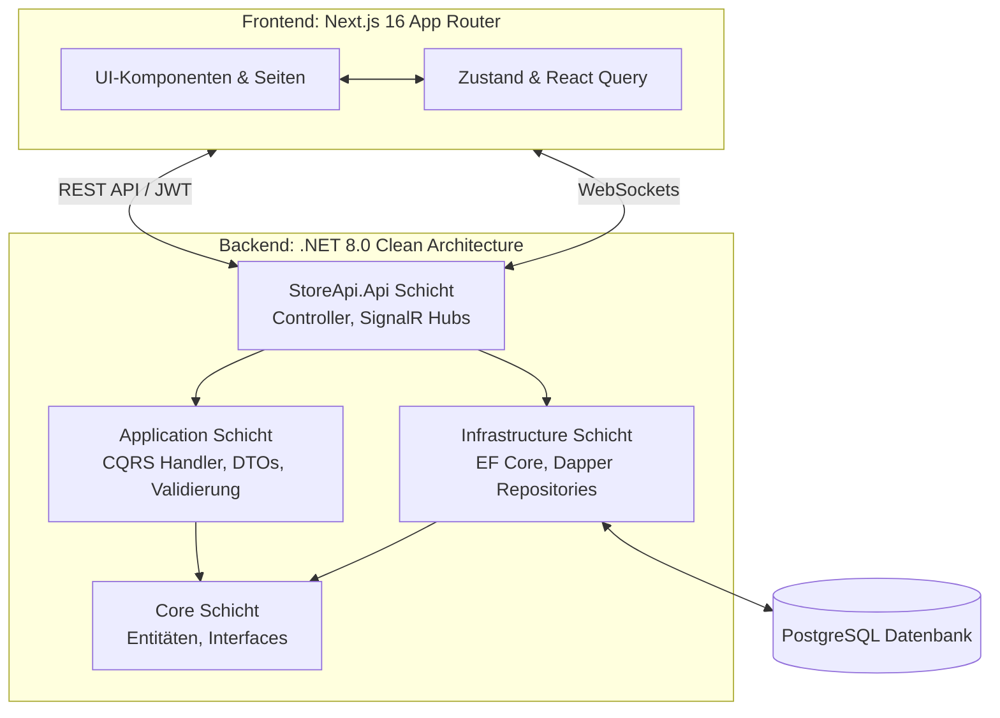

<div align="center">

# 🏪 Store Management System (POS)

<div align="center">
  <a href="README.md"></a>
  <a href="README.de.md"></a>
</div>

### Integriertes Filial- und Point-of-Sale-Managementsystem

<p align="center">
  <strong>Eine unternehmenstaugliche, vollumfängliche Lösung für Filial- und Kassensysteme</strong>
</p>

<br/>


<br/>


---

[Funktionen](#-hauptfunktionen) •
[Technologie-Stack](#-technologie-stack) •
[Architektur](#-architekturdesign) •
[Testen](#-testen) •
[Screenshots](#-screenshots) •
[Erste Schritte](#-erste-schritte) •
[API-Endpunkte](#-wichtige-api-endpunkte)

</div>

<br/>

## 🎯 Übersicht

Das **Store Management System** ist eine robuste, hochskalierbare Webanwendung zur Abwicklung aller Aspekte des Point-of-Sale (POS) und der Bestandsverwaltung. Aufgebaut nach dem Clean-Architecture-Ansatz, erzwingt es eine strikte Trennung der Verantwortlichkeiten und nutzt CQRS mit MediatR im Backend sowie eine funktionsbasierte, modulare Struktur im Frontend. Dieses System ist auf hohe Leistung, Zuverlässigkeit und einfache Erweiterbarkeit ausgelegt.

## ✨ Hauptfunktionen

### 📦 Bestands- & Produktmanagement
- **Intelligente Kategorisierung:** Organisieren Sie Produkte mit Unterstützung für mehrstufige Kategorien.
- **Echtzeit-Verfolgung:** Genaue Bestandsverfolgung mit automatisierten Warnungen bei niedrigem Lagerbestand über SignalR.

### 🛒 Verkauf & Bestellabwicklung (POS)
- **Schneller Checkout:** Optimierte Point-of-Sale-Oberfläche für schnelle Transaktionen.
- **Rechnungserstellung:** Elektronische Rechnungsstellung mit direkter Druckunterstützung und QR-Code-Generierung für Compliance.
- **Retourenmanagement:** Flexible und detaillierte Verfolgung von Produktrückgaben und -umtausch.

### 💰 Finanzen & Schuldenmanagement
- **Zahlungsverfolgung:** Erfassen und Überwachen von Zahlungen über verschiedene Zahlungsmethoden hinweg.
- **Schuldenverfolgung:** Gezielte Verwaltung von Kundenschulden mit automatisierten Erinnerungen.
- **Kundenprofile:** Umfassendes Kundenmanagement mit Kauf- und Schuldenhistorien.

### 📊 Echtzeit-Dashboard & Analytik
- **Live-Metriken:** Finanzstatistiken und Berichte in Echtzeit, die über SignalR übertragen werden.
- **Interaktive Diagramme:** Visuelle Analyse von Verkaufstrends und Einnahmen im Zeitverlauf mit Recharts.
- **Anpassbare KPIs:** Verfolgen Sie die wichtigsten Kennzahlen auf einen Blick.

### 🔐 Erweiterte Sicherheit & Auditing
- **Mehrschichtige Authentifizierung:** Sichere JWT-Implementierung mit Refresh-Token-Rotation.
- **RBAC:** Strikte rollenbasierte Zugriffskontrolle (Role-Based Access Control) und benutzerdefinierte Autorisierungsrichtlinien.
- **Audit-Protokollierung:** Umfassende Verfolgung aller Systemänderungen über administrative Aktionen hinweg.

<br/>

## 📸 Screenshots

<div align="center">
  <table>
    <tr>
      <td align="center">
        
        <br/><strong>Sicherer Login</strong>
      </td>
      <td align="center">
        
        <br/><strong>Echtzeit-Dashboard</strong>
      </td>
    </tr>
    <tr>
      <td align="center">
        
        <br/><strong>Point of Sale (POS) Oberfläche</strong>
      </td>
      <td align="center">
        
        <br/><strong>Produkte & Bestand</strong>
      </td>
    </tr>
    <tr>
      <td align="center">
        
        <br/><strong>Kundenverwaltung</strong>
      </td>
      <td align="center">
        
        <br/><strong>Bestellhistorie</strong>
      </td>
    </tr>
     <tr>
      <td align="center">
        
        <br/><strong>Zahlungsverfolgung</strong>
      </td>
      <td align="center">
        
        <br/><strong>Kunden-Schuldenverwaltung</strong>
      </td>
    </tr>
  </table>

  DEMO:
  *Standard-Admin-Login: `Admin@Store.com` / `Admin123!`*
</div>

<br/>

## 🛠️ Technologie-Stack

### Frontend (Next.js & React)

| Bibliothek / Tool | Zweck |
|-------------------|-------|
| **Next.js 16** | App Router, Server Components, Turbopack |
| **React 19** | Kern-UI-Bibliothek |
| **TypeScript 5** | Typsichere Entwicklung |
| **Tailwind CSS 4** | Utility-First Styling-Framework |
| **Zustand** | Leichtgewichtiges, schnelles clientseitiges State-Management |
| **TanStack React Query** | Server-State-Management, Caching und Synchronisation |
| **SignalR Client (`@microsoft/signalr`)** | Echtzeit-WebSockets-Kommunikation |
| **Recharts** | Interaktive Datenvisualisierung und Diagramme |

### Backend (.NET 8 Web API)

| Technologie / Muster | Zweck |
|----------------------|-------|
| **.NET 8** | Hochleistungs-Backend-Framework |
| **Clean Architecture** | Trennung der Verantwortlichkeiten (Core, Application, Infrastructure, API) |
| **CQRS (MediatR)** | Command Query Responsibility Segregation für entkoppelte Logik |
| **PostgreSQL** | Primäre relationale Datenbank |
| **EF Core 8 & Dapper** | Duale ORM-Strategie: EF für CRUD, Dapper für komplexe Abfrageleistung |
| **ASP.NET Identity** | Benutzer- und Rollenverwaltung |
| **JWT Bearer Key** | Sichere Authentifizierung und Autorisierung |
| **FluentValidation** | Streng typisierte Anfragevalidierung |
| **SignalR** | Echtzeit-Push-Benachrichtigungen an das Frontend |
| **xUnit + Moq + FluentAssertions** | Unit-Tests mit Mocking und aussagekräftigen Assertions |

<br/>

## 🏗️ Architekturdesign



<br/>

## 🧪 Testen

Das Projekt umfasst eine umfassende Unit-Testing-Suite mit **xUnit**, **Moq** und **FluentAssertions**.

### Testabdeckung

| Modul | Tests | Was wird geprüft |
|-------|:-----:|------------------|
| **Category** | 4 | Hinzufügen, GetById — Erfolg & Fehler |
| **Login** | 3 | Gültige Anmeldeinformationen, Benutzer nicht gefunden, falsches Passwort + **Rollen-Claims** |
| **Register** | 2 | Erfolgreiche Registrierung, doppelte E-Mail |
| **Refresh Token** | 2 | Gültiger Refresh, abgelaufener Token |
| **Logout** | 1 | Token-Widerruf |
| **Sale (Bestellung)** | 2 | Auftragserstellung, Prozedurfehler + Hintergrund-Aufgabenwarteschlange |
| **Audit Middleware** | 2 | POST-Anfragen protokolliert, GET-Anfragen übersprungen |
| **Rate Limiting** | 3 | 5-Anfragen-Limit durchgesetzt, Konfigurationsvalidierung, 429 Statuscode |
| **Gesamt** | **19** | ✅ **Alle bestanden** |

### Tests ausführen

```bash
cd Backend
dotnet test
```

Für eine detaillierte Ausgabe mit einzelnen Testnamen:
```bash
dotnet test --verbosity normal
```

### Test-Stack

| Bibliothek | Zweck |
|------------|-------|
| **xUnit** | Test-Framework |
| **Moq** | Mocking von Abhängigkeiten (UserManager, IRepository, etc.) |
| **FluentAssertions** | Ausdrucksstarke, lesbare Assertions |

<br/>

## 🚀 Erste Schritte

### Voraussetzungen

| Anforderungen | Version |
|---------------|---------|
| Node.js | `>= 18.x` |
| .NET SDK | `8.0` |
| PostgreSQL | `>= 14` |

### 1️⃣ Backend Einrichtung

1. **Navigieren Sie zum Backend-Verzeichnis:**
   ```bash
   cd Backend
   ```
2. **Umgebung konfigurieren:**
   Kopieren Sie `.env.example` nach `.env` und füllen Sie Ihre PostgreSQL-Verbindungszeichenfolge und das JWT-Secret aus.
   ```bash
   cp .env.example .env
   ```
3. **Migrationen ausführen & Server starten:**
   ```bash
   dotnet restore
   dotnet ef database update --project StoreSystem.Infrastructure --startup-project StoreApi.Api
   dotnet run --project StoreApi.Api
   ```
   *Die API ist unter `http://localhost:5107` verfügbar, mit Swagger UI unter `/swagger`.*

### 2️⃣ Frontend Einrichtung

1. **Navigieren Sie zum Frontend-Verzeichnis:**
   ```bash
   cd FrontEnd
   ```
2. **Abhängigkeiten installieren:**
   ```bash
   npm install
   ```
3. **Umgebung konfigurieren:**
   Erstellen Sie `.env.local` und konfigurieren Sie die API-URL.
   ```bash
   # Fügen Sie hier Ihren API-Pfad hinzu
   NEXT_PUBLIC_API_URL="http://localhost:5107/api/v1"
   ```
4. **Entwicklungsserver starten:**
   ```bash
   npm run dev
   ```
   *Die Webanwendung ist unter `http://localhost:3000` zugänglich.*

<br/>

## 📡 Wichtige API-Endpunkte

Eine vollständig dokumentierte **Swagger UI** ist verfügbar, wenn die Anwendung ausgeführt wird. Nachfolgend finden Sie eine Auswahl der wichtigsten Endpunkte:

- **Auth:** `POST /api/v1/Auth/login`, `POST /api/v1/Auth/refresh`
- **Products:** `GET /api/v1/Product`, `POST /api/v1/Product`
- **Orders:** `GET /api/v1/Order`, `POST /api/v1/Order`
- **Dashboard:** `GET /api/v1/Dashboard`, `GET /api/v1/Dashboard/revenue`

*(Siehe Swagger für die vollständige Dokumentation einschließlich Details zu Sortierung, Filterung und Paginierung).*

<br/>

## 🤝 Mitwirken

Beiträge, Issues und Feature-Anfragen sind willkommen!

1. Forken Sie das Projekt
2. Erstellen Sie Ihren Feature-Branch (`git checkout -b feature/AmazingFeature`)
3. Committen Sie Ihre Änderungen (`git commit -m 'Add some AmazingFeature'`)
4. Pushen Sie in den Branch (`git push origin feature/AmazingFeature`)
5. Eröffnen Sie einen Pull Request

## 📝 Lizenz

Veröffentlicht unter der MIT-Lizenz. Weitere Informationen finden Sie unter `LICENSE`.

<div align="center">
  <p>Mit ❤️ und modernen Web-Technologien entwickelt</p>
</div>
