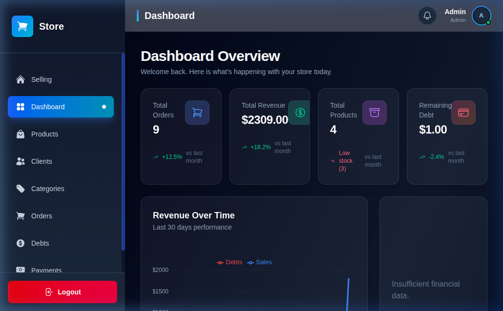
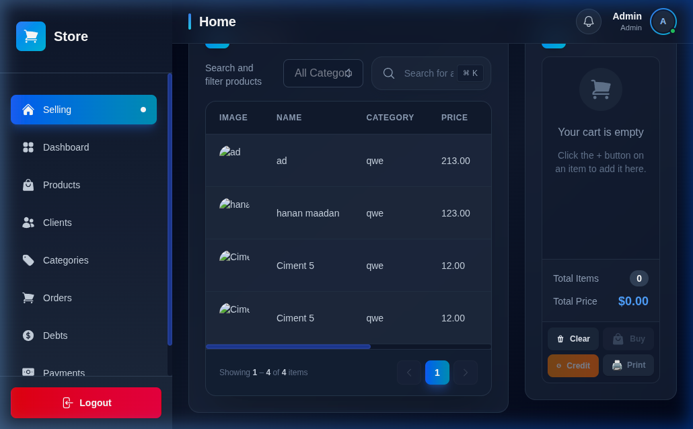
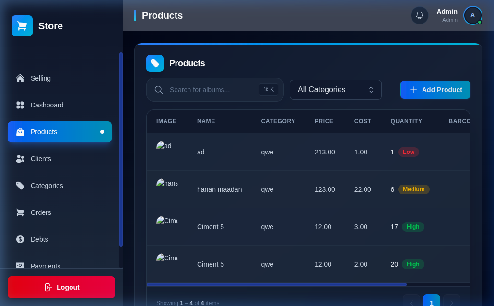
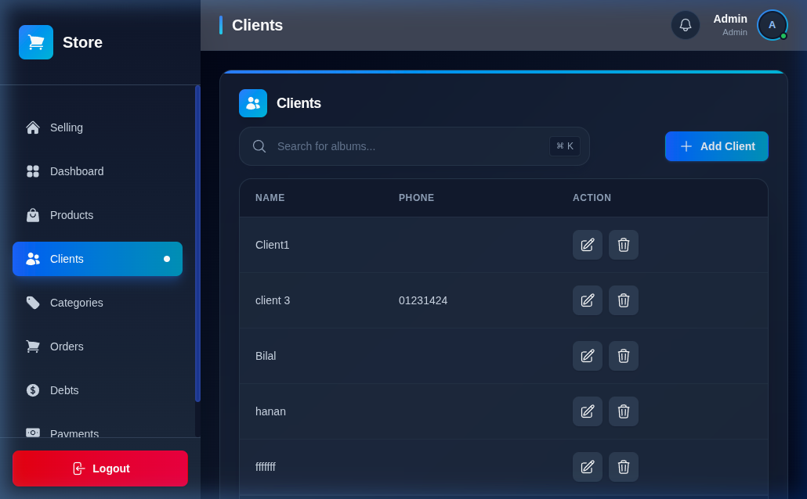
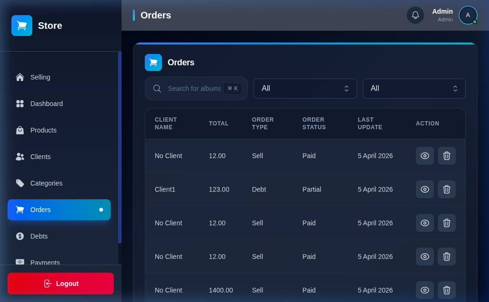
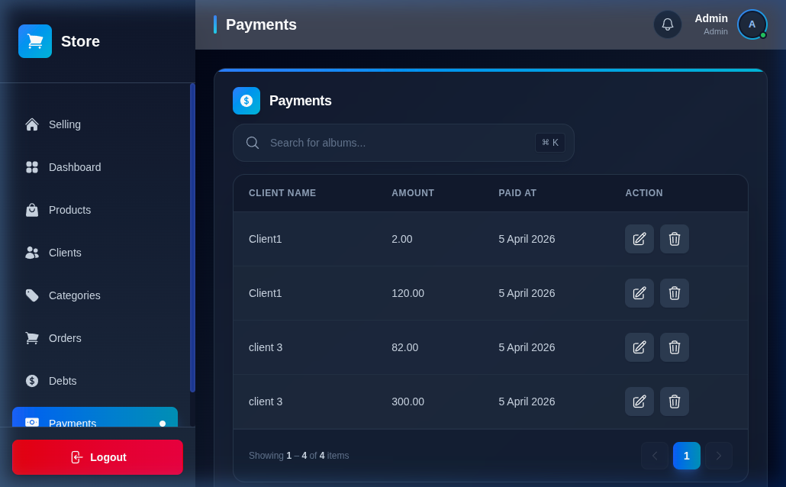

<div align="center">

# 🏪 Store Management System

### نظام إدارة المتاجر المتكامل

<p align="center">
  <strong>A modern, full-stack store management solution built with cutting-edge technologies</strong>
</p>

<br/>


<br/>


---

[Features](#-features) •
[Tech Stack](#-tech-stack) •
[Architecture](#-architecture) •
[Getting Started](#-getting-started) •
[API Endpoints](#-api-endpoints) •
[Project Structure](#-project-structure)

</div>

<br/>

## ✨ Features

| Feature                    | Description                                         |
| -------------------------- | --------------------------------------------------- |
| 🔐 **Authentication**      | Secure JWT-based auth with refresh token rotation   |
| 📦 **Product Management**  | Full CRUD with category-based organization          |
| 🏷️ **Categories**          | Hierarchical product categorization                 |
| 👥 **Client Management**   | Track and manage customer information               |
| 🛒 **Order Processing**    | Complete order lifecycle with item management       |
| 💰 **Payment Tracking**    | Monitor and record payments                         |
| 📊 **Debt Management**     | Track client debts and balances                     |
| 🔄 **Returns & Refunds**   | Handle product returns with item-level tracking     |
| 🚚 **Supplier Management** | Manage suppliers and supplier-product relationships |
| 📋 **Audit Logging**       | Track all system changes for accountability         |

<br/>

## 📸 Screenshots

<div align="center">
  <table>
    <tr>
      <td align="center">
        
        <br/><strong>Dashboard / Analytics</strong>
      </td>
      <td align="center">
        
        <br/><strong>Point of Sale (POS)</strong>
      </td>
    </tr>
    <tr>
      <td align="center">
        
        <br/><strong>Products Management</strong>
      </td>
      <td align="center">
        
        <br/><strong>Client Management</strong>
      </td>
    </tr>
    <tr>
      <td align="center">
        
        <br/><strong>Orders Management</strong>
      </td>
      <td align="center">
        
        <br/><strong>Payments Tracking</strong>
      </td>
    </tr>
  </table>
  
  *Default Admin Login: `Admin@Store.com` / `Admin123!`*
</div>

<br/>

## 🛠️ Tech Stack

### Frontend

<table>
  <tr>
    <td align="center" width="120">
      
      <br/><strong>Next.js 16</strong>
      <br/><sub>App Router + Turbopack</sub>
    </td>
    <td align="center" width="120">
      
      <br/><strong>React 19</strong>
      <br/><sub>Server Components</sub>
    </td>
    <td align="center" width="120">
      
      <br/><strong>TypeScript 5</strong>
      <br/><sub>Type Safety</sub>
    </td>
    <td align="center" width="120">
      
      <br/><strong>Tailwind CSS 4</strong>
      <br/><sub>Utility-First</sub>
    </td>
  </tr>
</table>

| Library                                                                                                                    | Purpose                             |
| -------------------------------------------------------------------------------------------------------------------------- | ----------------------------------- |
|  | Server state management & caching   |
|                                                | Lightweight client state management |
|                                                      | JWT token handling & validation     |
|                                            | Beautiful SVG icon library          |

### Backend

<table>
  <tr>
    <td align="center" width="120">
      
      <br/><strong>.NET 10</strong>
      <br/><sub>Web API</sub>
    </td>
    <td align="center" width="120">
      
      <br/><strong>C#</strong>
      <br/><sub>Clean Code</sub>
    </td>
    <td align="center" width="120">
      
      <br/><strong>PostgreSQL</strong>
      <br/><sub>Database</sub>
    </td>
  </tr>
</table>

| Library                                                                                                    | Purpose                                        |
| ---------------------------------------------------------------------------------------------------------- | ---------------------------------------------- |
|                    | ORM & database migrations                      |
|                                 | High-performance micro-ORM for complex queries |
|                                | Implementing CQRS pattern in Application layer |
|                          | Authentication middleware                      |
|  | API documentation & testing                    |
|              | User & role management                         |

<br/>

## 🏗️ Architecture

```
┌─────────────────────────────────────────────────────────────┐
│                        Frontend                             │
│  ┌───────────┐  ┌──────────┐  ┌──────────┐  ┌───────────┐  │
│  │  Next.js   │  │  Zustand  │  │ TanStack │  │ Tailwind  │  │
│  │ App Router │  │  Store    │  │  Query   │  │   CSS 4   │  │
│  └─────┬─────┘  └────┬─────┘  └────┬─────┘  └───────────┘  │
│        │              │             │                        │
│        └──────────────┴─────────────┘                        │
│                       │                                      │
└───────────────────────┼──────────────────────────────────────┘
                        │  REST API (JWT Auth)
┌───────────────────────┼──────────────────────────────────────┐
│                       │           Backend                    │
│  ┌────────────────────▼────────────────────────────────────┐ │
│  │              StoreApi.Api (Presentation)                │ │
│  │         Controllers · Middleware · Authorization        │ │
│  └────────────────────┬────────────────────────────────────┘ │
│  ┌────────────────────▼────────────────────────────────────┐ │
│  │         StoreSystem.Application (Business Logic)        │ │
│  │              Services · DTOs · Validators               │ │
│  └────────────────────┬────────────────────────────────────┘ │
│  ┌────────────────────▼────────────────────────────────────┐ │
│  │              StoreSystem.Core (Domain)                  │ │
│  │        Entities · Interfaces · Enums · Models           │ │
│  └────────────────────┬────────────────────────────────────┘ │
│  ┌────────────────────▼────────────────────────────────────┐ │
│  │       StoreSystem.Infrastructure (Data Access)          │ │
│  │     EF Core · Dapper · Migrations · Repositories       │ │
│  └─────────────────────────────────────────────────────────┘ │
│                           │                                  │
└───────────────────────────┼──────────────────────────────────┘
                            │
                   ┌────────▼────────┐
                   │   PostgreSQL    │
                   │    Database     │
                   └─────────────────┘
```

<br/>

## 🚀 Getting Started

### Prerequisites

| Tool       | Version   |
| ---------- | --------- |
| Node.js    | `>= 18.x` |
| .NET SDK   | `10.0`    |
| PostgreSQL | `>= 14`   |

### 1️⃣ Clone the Repository

```bash
git clone https://github.com/b2i0l0a3l/Store.git
cd Store
```

### 2️⃣ Backend Setup

```bash
# Navigate to backend
cd Backend

# Copy environment variables
cp .env.example .env
# Edit .env with your database connection string and JWT settings

# Restore dependencies
dotnet restore

# Apply database migrations
dotnet ef database update --project StoreSystem.Infrastructure --startup-project StoreApi.Api

# Run the API server
dotnet run --project StoreApi.Api
```

> [!TIP]
> The API will be available at `https://localhost:5001` with Swagger UI at `/swagger`

### 3️⃣ Frontend Setup

```bash
# Navigate to frontend
cd FrontEnd

# Install dependencies
npm install

# Configure environment
cp .env.local.example .env.local
# Set NEXT_PUBLIC_API_URL to your backend URL

# Start development server (with Turbopack ⚡)
npm run dev
```

> [!TIP]
> The app will be available at `http://localhost:3000`

<br/>

## 📡 API Endpoints

<details>
<summary><strong>🔐 Authentication</strong></summary>

| Method | Endpoint             | Description            |
| ------ | -------------------- | ---------------------- |
| `POST` | `/api/auth/register` | Register a new user    |
| `POST` | `/api/auth/login`    | Login & get JWT tokens |
| `POST` | `/api/auth/refresh`  | Refresh access token   |

</details>

<details>
<summary><strong>📦 Products</strong></summary>

| Method   | Endpoint             | Description          |
| -------- | -------------------- | -------------------- |
| `GET`    | `/api/products`      | Get all products     |
| `GET`    | `/api/products/{id}` | Get product by ID    |
| `POST`   | `/api/products`      | Create a new product |
| `PUT`    | `/api/products/{id}` | Update a product     |
| `DELETE` | `/api/products/{id}` | Delete a product     |

</details>

<details>
<summary><strong>🏷️ Categories</strong></summary>

| Method   | Endpoint               | Description           |
| -------- | ---------------------- | --------------------- |
| `GET`    | `/api/categories`      | Get all categories    |
| `GET`    | `/api/categories/{id}` | Get category by ID    |
| `POST`   | `/api/categories`      | Create a new category |
| `PUT`    | `/api/categories/{id}` | Update a category     |
| `DELETE` | `/api/categories/{id}` | Delete a category     |

</details>

<details>
<summary><strong>👥 Clients</strong></summary>

| Method   | Endpoint            | Description         |
| -------- | ------------------- | ------------------- |
| `GET`    | `/api/clients`      | Get all clients     |
| `GET`    | `/api/clients/{id}` | Get client by ID    |
| `POST`   | `/api/clients`      | Create a new client |
| `PUT`    | `/api/clients/{id}` | Update a client     |
| `DELETE` | `/api/clients/{id}` | Delete a client     |

</details>

<details>
<summary><strong>🛒 Orders · 💰 Payments · 📊 Debts · 🔄 Returns · 🚚 Suppliers</strong></summary>

> Full CRUD endpoints available for all resources. See Swagger UI for complete documentation.

</details>

<br/>

## 📁 Project Structure

```
store/
├── 📂 Backend/                          # .NET 10 Web API
│   ├── 📂 StoreApi.Api/                 # Presentation Layer
│   │   ├── 📂 Controllers/              # API Controllers (12)
│   │   ├── 📂 Authorization/            # Auth configuration
│   │   ├── 📂 Middleware/               # Custom middleware
│   │   └── 📄 Program.cs               # App entry point
│   ├── 📂 StoreSystem.Application/      # Business Logic Layer
│   ├── 📂 StoreSystem.Core/             # Domain Layer
│   │   ├── 📂 Entities/                 # Domain entities (14)
│   │   ├── 📂 Models/                   # DTOs & view models
│   │   ├── 📂 Interfaces/              # Repository contracts
│   │   └── 📂 Enums/                   # Enumerations
│   └── 📂 StoreSystem.Infrastructure/   # Data Access Layer
│       ├── 📂 Migrations/              # EF Core migrations
│       ├── 📂 Presistence/             # DbContext & configs
│       └── 📂 Shared/                  # Shared implementations
│
└── 📂 FrontEnd/                         # Next.js 16 App
    └── 📂 app/
        ├── 📂 (auth)/                   # Auth pages (Login/Register)
        ├── 📂 (marketing)/              # Public pages
        ├── 📂 Features/                 # Feature modules
        │   ├── 📂 Products/             # Product management
        │   ├── 📂 Categories/           # Category management
        │   ├── 📂 clients/              # Client management
        │   ├── 📂 Orders/               # Order management
        │   ├── 📂 Debts/                # Debt tracking
        │   └── 📂 Sells/               # Sales management
        ├── 📂 components/               # Shared UI components
        └── 📂 util/                     # Utilities & helpers
```

<br/>

## 🔑 Key Design Decisions

- **CQRS Pattern** — Clear separation of Commands (Writes) and Queries (Reads) using **MediatR** in the Application layer
- **Clean Architecture** — Backend follows layered architecture with dependency inversion
- **Feature-Based Architecture** — Frontend organized by business feature for scalability
- **Dual ORM Strategy** — EF Core for CRUD operations + Dapper for complex/performance-critical queries
- **Server Components** — Leverages React 19 Server Components for optimal performance
- **Turbopack** — Uses Next.js Turbopack for lightning-fast development builds

<br/>

## 🤝 Contributing

Contributions are welcome! Please feel free to submit a Pull Request.

1. Fork the repository
2. Create your feature branch (`git checkout -b feature/amazing-feature`)
3. Commit your changes (`git commit -m 'Add some amazing feature'`)
4. Push to the branch (`git push origin feature/amazing-feature`)
5. Open a Pull Request

<br/>

## 📝 License

This project is licensed under the MIT License — see the [LICENSE](LICENSE) file for details.

<br/>

<div align="center">

---

<p>
  <sub>Built with ❤️ using modern web technologies</sub>
</p>


</div>
