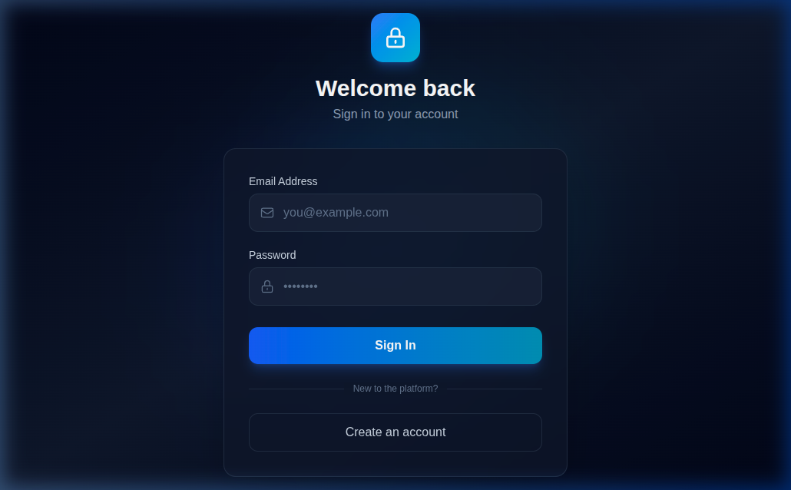
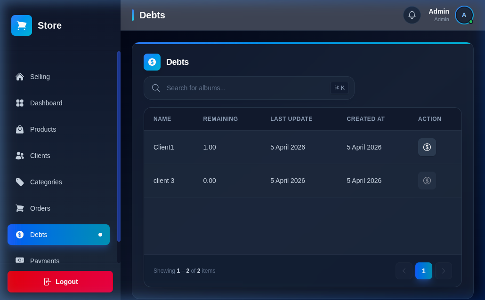
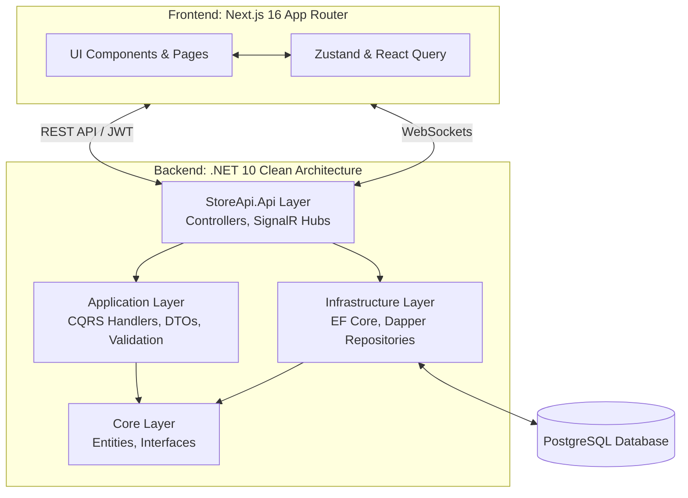

<div align="center">

# 🏪 Store Management System (POS)

### نظام إدارة المتاجر ونقاط البيع المتكامل

<p align="center">
  <strong>An Enterprise-Grade, Full-Stack Store & Point of Sale Management Solution</strong>
</p>

<br/>


<br/>


---

[Features](#-key-features) •
[Tech Stack](#-tech-stack) •
[Architecture](#-architecture-design) •
[Screenshots](#-screenshots) •
[Getting Started](#-getting-started) •
[API Endpoints](#-essential-api-endpoints)

</div>

<br/>

## 🎯 Overview

The **Store Management System** is a robust, highly scalable web application designed to handle all aspects of point-of-sale (POS) and inventory management operations. Built with a clean architecture approach, it enforces strict separation of concerns, utilizing CQRS with MediatR on the backend and a feature-based modular structure on the frontend. This system is designed for high performance, reliability, and ease of expansion.

## ✨ Key Features

### 📦 Inventory & Product Management
- **Smart Categorization:** Organize products with multi-level category support.
- **Real-time Tracking:** Accurate inventory tracking with automated low-stock alerts via SignalR.


### 🛒 Sales & Order Processing (POS)
- **Fast Checkout:** Optimized Point of Sale interface for rapid transactions.
- **Invoice Generation:** Electronic invoicing with direct print support and QR code generation for compliance.
- **Returns Management:** Flexible and detailed tracking of product returns and exchanges.

### 💰 Finance & Debt Management
- **Payment Tracking:** Log and monitor payments across multiple payment methods.
- **Debt Tracking:** Dedicated management of client debts with automated reminders.
- **Client Profiles:** Comprehensive client management with purchase and debt histories.

### 📊 Real-time Dashboard & Analytics
- **Live Metrics:** Real-time financial statistics and reporting pushed via SignalR.
- **Interactive Charts:** Visual analysis of sales trends and revenue over time using Recharts.
- **Customizable KPIs:** Track the most important metrics at a glance.

### 🔐 Advanced Security & Auditing
- **Multi-layer Auth:** Secure JWT implementation with Refresh Token rotation.
- **RBAC:** Strict Role-Based Access Control and custom authorization policies.
- **Audit Logging:** Comprehensive tracking of all system modifications across administrative actions.

<br/>

## 📸 Screenshots


<div align="center">
  <table>
    <tr>
      <td align="center">
        
        <br/><strong>Secure Login</strong>
      </td>
      <td align="center">
        
        <br/><strong>Real-time Dashboard</strong>
      </td>
    </tr>
    <tr>
      <td align="center">
        
        <br/><strong>Point of Sale (POS) Interface</strong>
      </td>
      <td align="center">
        
        <br/><strong>Products & Inventory</strong>
      </td>
    </tr>
    <tr>
      <td align="center">
        
        <br/><strong>Client Management</strong>
      </td>
      <td align="center">
        
        <br/><strong>Orders History</strong>
      </td>
    </tr>
     <tr>
      <td align="center">
        
        <br/><strong>Payments Tracking</strong>
      </td>
      <td align="center">
        
        <br/><strong>Client Debts Management</strong>
      </td>
    </tr>
  </table>

  DEMO:
  *Default Admin Login: `Admin@Store.com` / `Admin123!`*
</div>

<br/>

## 🛠️ Tech Stack

### Frontend (Next.js & React)

| Library / Tool | Purpose |
|----------------|---------|
| **Next.js 16** | App Router, Server Components, Turbopack |
| **React 19** | Core UI library |
| **TypeScript 5** | Type-safe development |
| **Tailwind CSS 4** | Utility-first styling framework |
| **Zustand** | Lightweight, fast client-side state management |
| **TanStack React Query** | Server state management, caching, and synchronization |
| **SignalR Client (`@microsoft/signalr`)** | Real-time WebSockets communication |
| **Recharts** | Interactive data visualization and charts |

### Backend (.NET 10 Web API)

| Technology / Pattern | Purpose |
|----------------------|---------|
| **.NET 10** | High-performance backend framework |
| **Clean Architecture** | Separation of concerns (Core, Application, Infrastructure, API) |
| **CQRS (MediatR)** | Command Query Responsibility Segregation for decoupled logic |
| **PostgreSQL** | Primary relational database |
| **EF Core 10 & Dapper** | Dual ORM strategy: EF for CRUD, Dapper for complex query performance |
| **ASP.NET Identity** | User and Role management |
| **JWT Bearer Key** | Secure authentication and authorization |
| **FluentValidation** | Strongly-typed request validation |
| **SignalR** | Real-time push notifications to the frontend |

<br/>

## 🏗️ Architecture Design



<br/>

## 🚀 Getting Started

### Prerequisites

| Requirements | Version |
|--------------|---------|
| Node.js | `>= 18.x` |
| .NET SDK | `10.0` |
| PostgreSQL | `>= 14` |

### 1️⃣ Backend Setup

1. **Navigate to the Backend directory:**
   ```bash
   cd Backend
   ```
2. **Configure Environment:**
   Copy `.env.example` to `.env` and fill in your PostgreSQL connection string and JWT secret.
   ```bash
   cp .env.example .env
   ```
3. **Run Migrations & Start Server:**
   ```bash
   dotnet restore
   dotnet ef database update --project StoreSystem.Infrastructure --startup-project StoreApi.Api
   dotnet run --project StoreApi.Api
   ```
   *The API will be available at `http://localhost:5107` with Swagger UI at `/swagger`.*

### 2️⃣ Frontend Setup

1. **Navigate to the Frontend directory:**
   ```bash
   cd FrontEnd
   ```
2. **Install Dependencies:**
   ```bash
   npm install
   ```
3. **Configure Environment:**
   Create `.env.local` and configure the API URL.
   ```bash
   # Add your API path here
   NEXT_PUBLIC_API_URL="http://localhost:5107/api/v1"
   ```
4. **Start Development Server:**
   ```bash
   npm run dev
   ```
   *The web application will be accessible at `http://localhost:3000`.*

<br/>

## 📡 Essential API Endpoints

A fully documented **Swagger UI** is available when running the application. Below is a subset of core endpoints:

- **Auth:** `POST /api/v1/Auth/login`, `POST /api/v1/Auth/refresh`
- **Products:** `GET /api/v1/Product`, `POST /api/v1/Product`
- **Orders:** `GET /api/v1/Order`, `POST /api/v1/Order`
- **Dashboard:** `GET /api/v1/Dashboard`, `GET /api/v1/Dashboard/revenue`

*(Refer to swagger for full documentation including sorting, filtering, and pagination details).*

<br/>

## 🤝 Contributing

Contributions, issues, and feature requests are welcome!

1. Fork the Project
2. Create your Feature Branch (`git checkout -b feature/AmazingFeature`)
3. Commit your Changes (`git commit -m 'Add some AmazingFeature'`)
4. Push to the Branch (`git push origin feature/AmazingFeature`)
5. Open a Pull Request

## 📝 License

Distributed under the MIT License. See `LICENSE` for more information.

<div align="center">
  <p>Built with ❤️ using modern web technologies</p>
</div>
